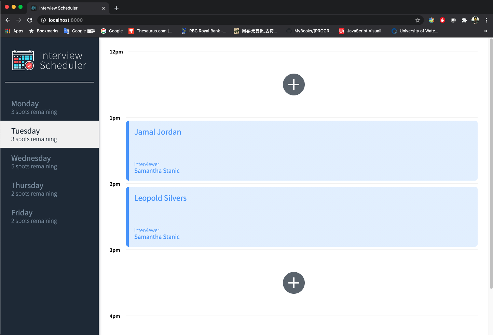
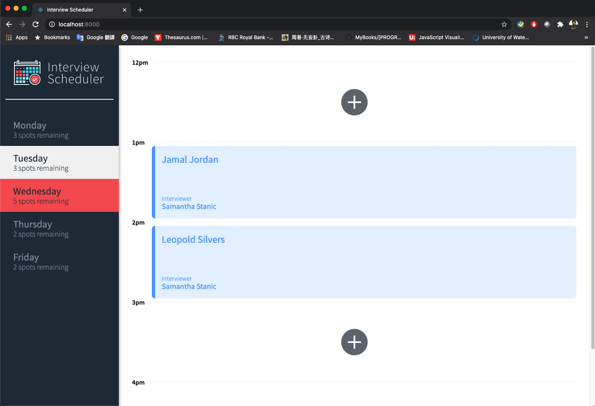
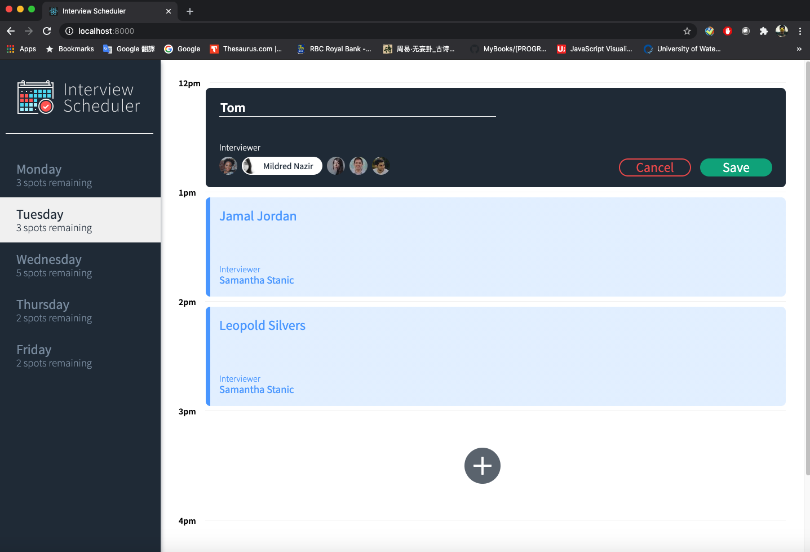
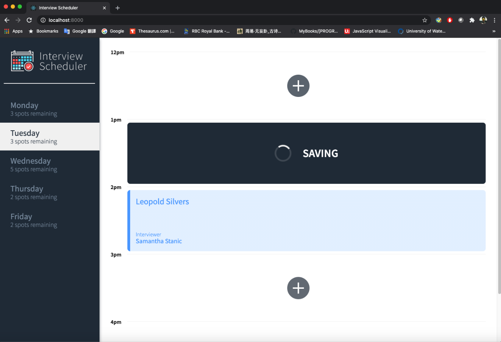
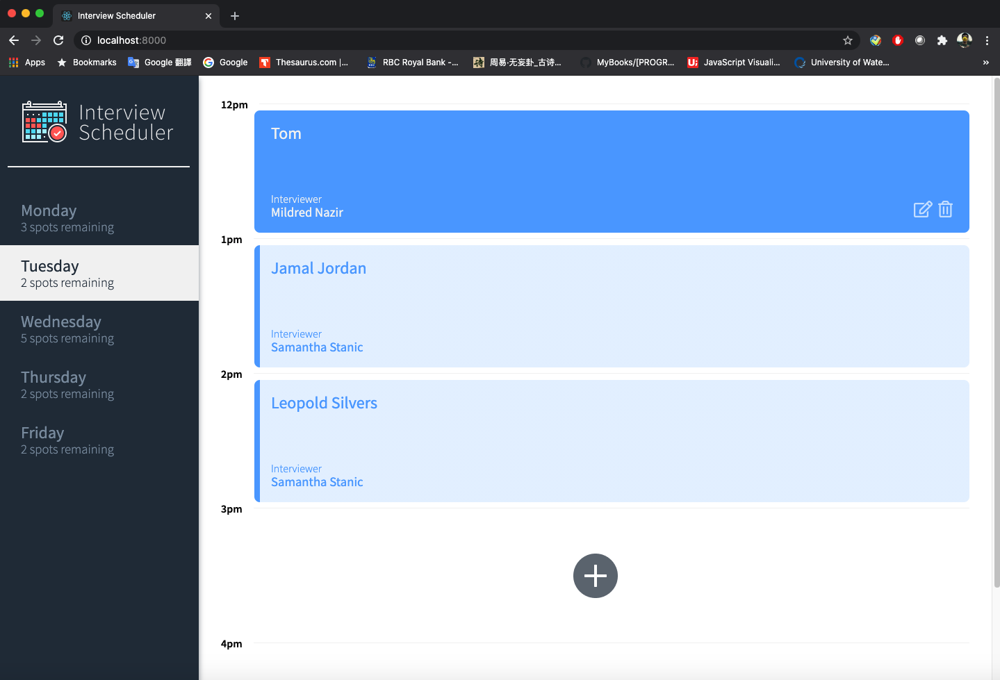
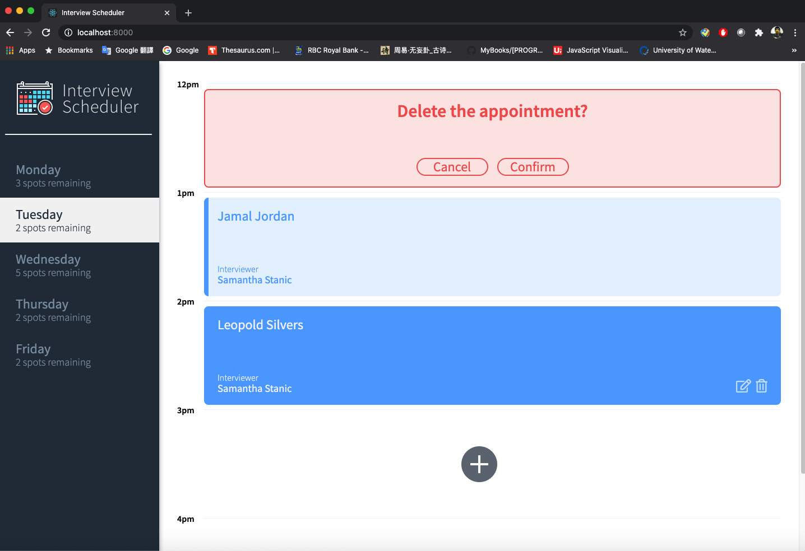
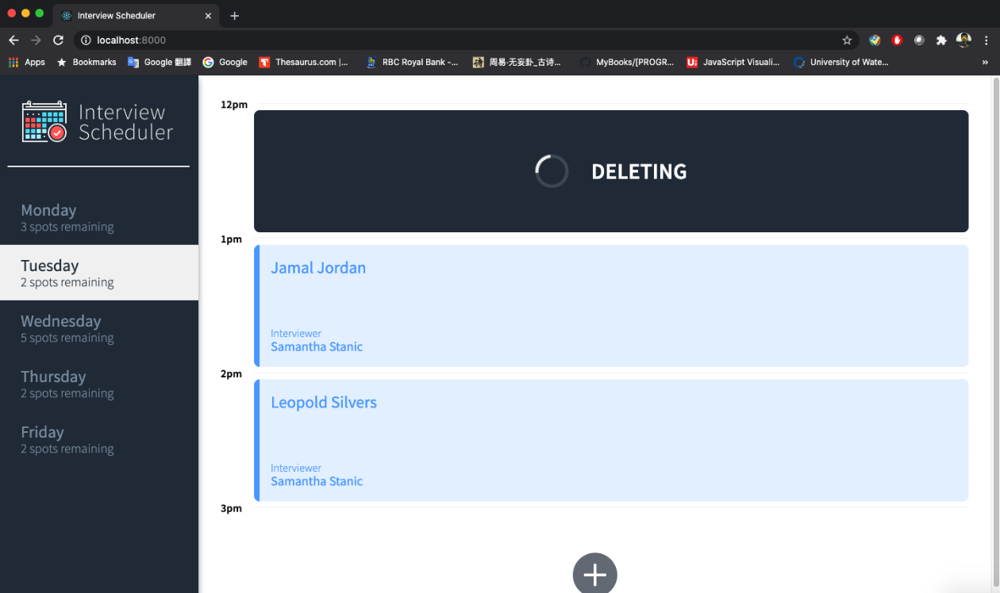
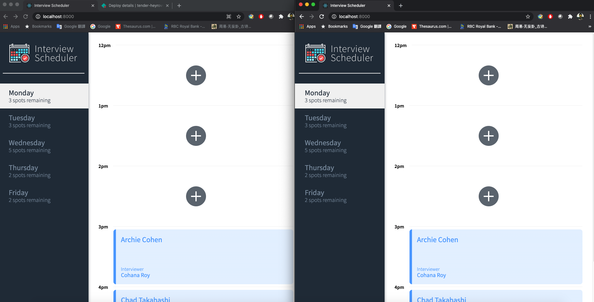
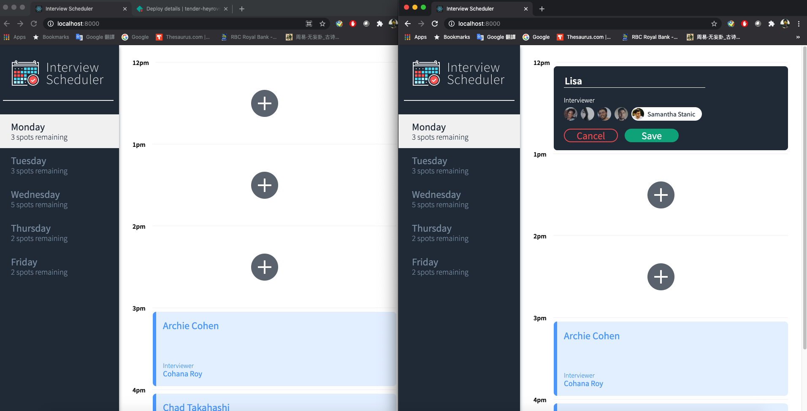
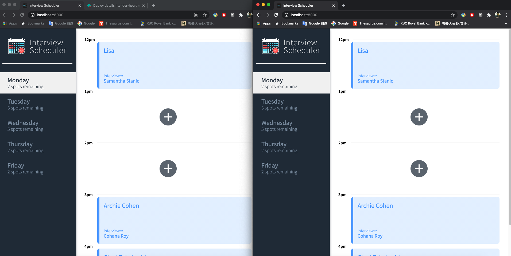

# Interview Scheduler

This is a single page application (SPA), built using React. Data is persisted by the API server using a PostgreSQL database. The client communicate with an API servier using websocket in JSON format. Jest tests are used through the development of the project. The final project is deploied on Heroku (https://scheduler-lhl-yi.herokuapp.com/, api/days/, api/appointments/ and api/interviewers/) and Netlify (https://tender-heyrovsky-137311.netlify.app).

Technical Specs:

1. React
2. Webpack, Babel
3. Axios, WebSockets
4. Storybook, Webpack Dev Server, Jest, Testing Library
5. Node.js and express

## Setup

Install dependencies with `npm install`.

## Running Webpack Development Server

```sh
npm start
```

## Running Jest Test Framework

```sh
npm test
```

## Running Storybook Visual Testbed

```sh
npm run storybook
```

## Final Product












